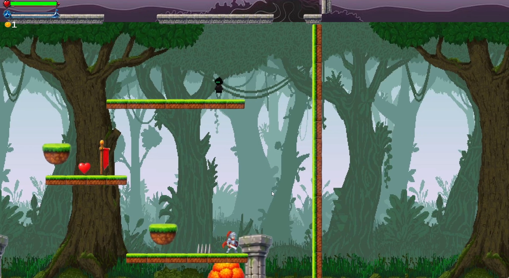
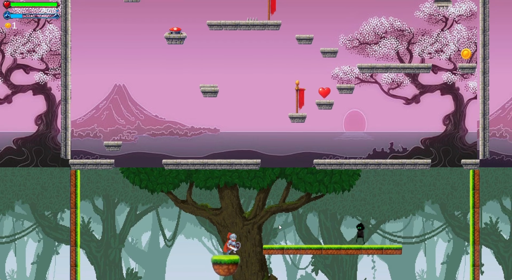
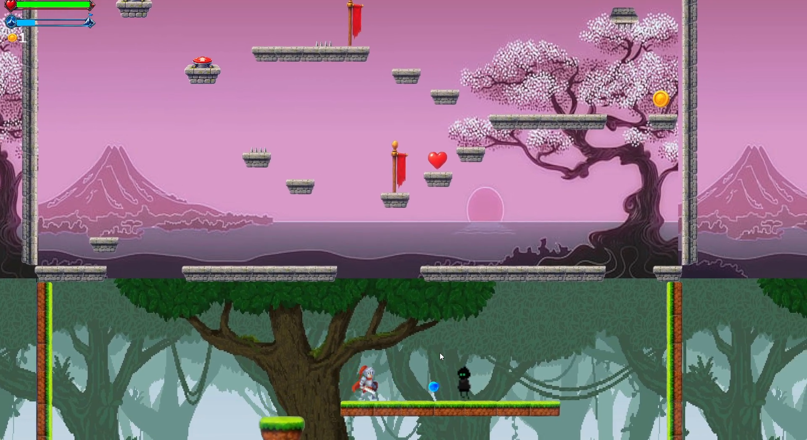
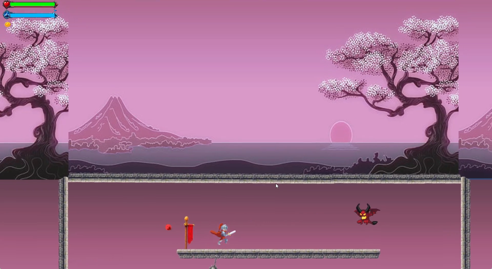
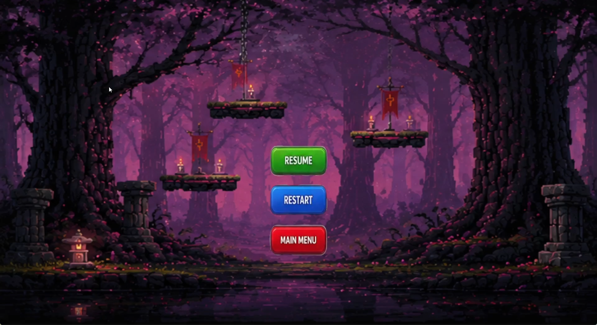
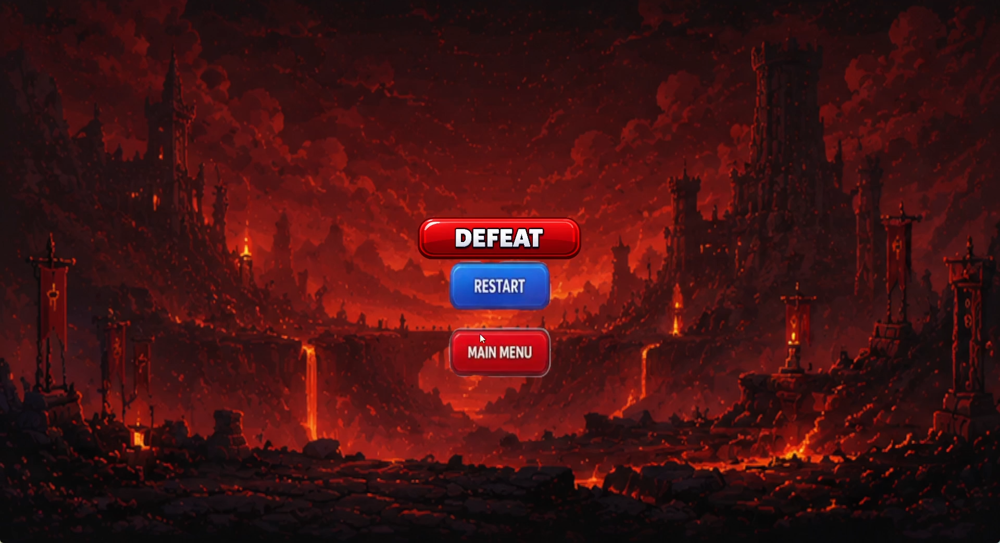
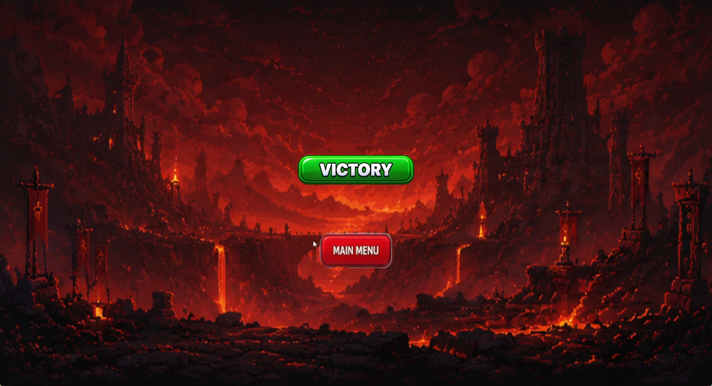

# Project Ascend

### 2D Action-Platformer • Unity • C#

Project Ascend is a 2D action-platformer developed in Unity using C#. Players progress through visually distinct environments while navigating platforming challenges, avoiding hazards, battling enemies and working towards completing each level.

---

## 🎮 Gameplay

Project Ascend combines platforming, combat and level progression across multiple environments.

### Core Features

- 2D player movement
- Platforming mechanics
- Enemy combat
- Enemy behaviour
- Player health and damage
- Environmental hazards
- Multiple levels and environments
- Level progression
- Gameplay UI
- Game-state management
- Scene management

---

## 🛠️ Technologies

- Unity
- C#
- Visual Studio
- Unity 2D
- Unity Animator

---

## 📸 Gameplay Screenshots

### Gameplay

### Pause Menu

### Defeat

### Victory

---

## 💻 Selected Source Code

This repository contains selected and presentation-cleaned C# scripts from the completed Project Ascend project, highlighting several of the game's core gameplay systems.

Source-code links will be added after the selected scripts are uploaded.

---

## 👨‍💻 Developer

**Ahsan Akbar**

Unity & C# Game Developer

Portfolio: Coming soon  
LinkedIn: Coming soon
